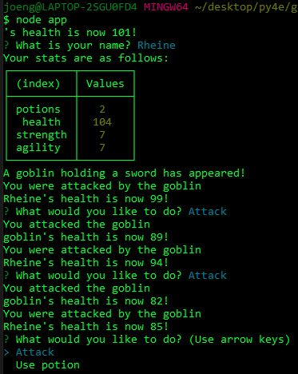
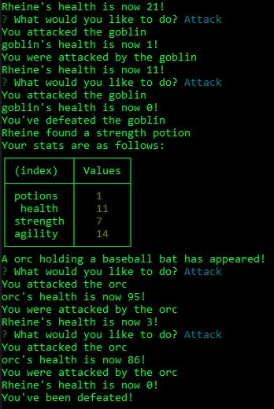

# Jest Another RPG
An RPG game that can only be ran through using node in the terminal.
Try your hand at it.  It's fun!

## Installation
In order to get to play the RPG game, you would need to clone the repository.
Install node and use the terminal to call 'node app' to start the game.

## Created using
* Javascript
* Node.js
* ES6
* npm

## Link to Repository
https://github.com/itsrheine/jest-another-RPG

## Screenshot
  

